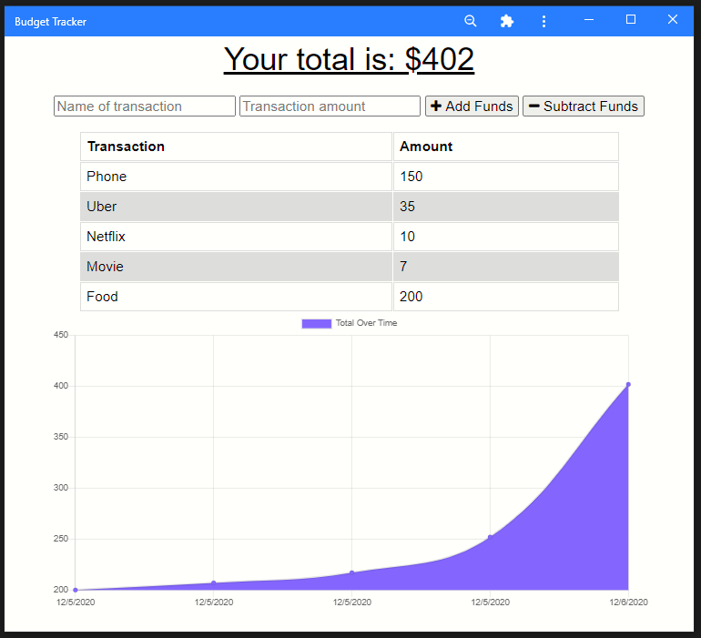

# Budget Tracker

# License
  

# Table of Contents

- [Description](#description)
- [Installation](#installation)
- [Links](#links)
- [Screenshot](#screenshot)
- [Questions](#questions)

# Description
This is an interactive budget tracker for travelers which will create a graph of your expenses by adding and subtracting transactions.  The beauty of this app is it is functional in both online and offline.  All entries made are saved on the website, if in any case internet falters while submitting an entry, it will still save until the internet is back online.

# Built With
- Javascript
- NPM express
- Node.js
- Express.js
- Mongoose
- NoSQL
- Heroku
- MongoDB
- IndexedDB

# Installation
- You may access this budget-tracker through Heroku website and use it as a standalone by clicking the + sign next to your URL line.

# Links
- Link to repository: https://github.com/itsrheine/budget-tracker
- Link to Heroku: https://protected-basin-21646.herokuapp.com/

# Screenshot

# Questions
If you have any questions or concerns, please feel free to reach out to my:
- Email: [mtiamsic@gmail.com](mtiamsic@gmail.com)
- Github: [itsrheine](https://github.com/itsrheine)
